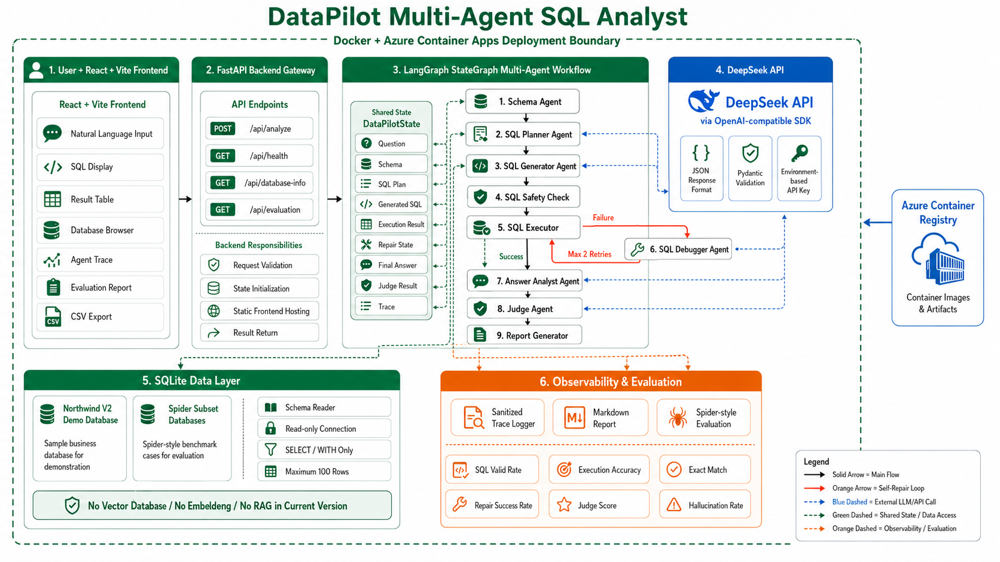

# DataPilot Multi-Agent SQL Analyst

**简体中文** | [English](README.md)

DataPilot 是一个基于 LangGraph、DeepSeek API 和 SQLite 的多智能体 Text-to-SQL 数据分析系统。系统可以将自然语言问题转换为可执行 SQL，在查询失败时自动修复，解释执行结果，评估回答质量，并记录完整 Agent 执行轨迹。

**在线演示：** [datapilot-sql-agent.gentlefield-019d4ae8.eastasia.azurecontainerapps.io](https://datapilot-sql-agent.gentlefield-019d4ae8.eastasia.azurecontainerapps.io/)

## 系统架构


## 核心功能

- 自然语言转 SQLite SQL
- 自动读取数据库表结构、关系和样例数据
- 使用 Pydantic 校验 SQL 计划与生成结果
- 只读 SQL 安全检查与真实查询执行
- 基于 LangGraph 条件路由的 SQL 自修复，最多重试两次
- 基于查询结果生成忠实回答
- LLM-as-a-Judge 质量评估
- Spider-style 离线评测
- JSON Trace 与 Markdown 分析报告
- React + Vite 数据分析工作台
- 未配置 API Key 时支持本地 fallback Demo

## Multi-Agent 工作流

```text
用户问题
  -> Schema Agent
  -> SQL Planner
  -> SQL Generator
  -> SQL Executor
  -> SQL Debugger（失败时进入，最多重试 2 次）
  -> Answer Analyst
  -> Judge Agent
  -> Report Generator
```

## 技术栈

- Python 3.10+
- LangGraph
- DeepSeek API 与 OpenAI SDK
- FastAPI 与 Gunicorn
- SQLite 与 pandas
- Pydantic
- React 与 Vite
- pytest
- Docker
- Azure Container Apps 与 Azure Container Registry

## 目录结构

```text
data/       Northwind Demo 数据库与 Spider subset
eval/       离线评测脚本与指标
frontend/   React + Vite 前端
scripts/    数据库创建、检查和数据集准备脚本
src/        Agent Graph、API、SQL 工具、Prompt、Judge 和报告
tests/      单元测试与集成测试
```

## 环境变量

根据 `.env.example` 创建 `.env`：

```env
OPENAI_API_KEY=your_deepseek_api_key
OPENAI_BASE_URL=https://api.deepseek.com
MODEL_NAME=deepseek-chat
```

API Key 仅由 Python 后端读取，不会提交到 Git，也不会打包到前端。未配置 Key 时，Northwind Demo 会自动使用本地 fallback 生成器。

## 本地运行

```bash
python -m venv .venv
python -m pip install -r requirements.txt
python scripts/create_northwind_db.py
python scripts/check_databases.py
```

运行命令行 Demo：

```bash
python -m src.main --db-path data/northwind/northwind.db --question "Which product categories have the highest sales?"
```

开发模式运行 API 和前端：

```bash
# 终端 1
python -m uvicorn src.api:app --host 127.0.0.1 --port 8000

# 终端 2
cd frontend
npm install
npm run dev
```

Vite 开发服务器会将 `/api` 代理到 Python API。生产 Docker 镜像会从同一域名提供编译后的前端和 API。

## Spider 离线评测

项目不会自动下载 Spider。使用本地 Spider 数据集准备子集：

```bash
python scripts/prepare_spider_subset.py --spider-root /path/to/spider --split dev --limit 50
```

运行评测：

```bash
python eval/run_eval.py --cases data/spider_subset/eval_cases.json --limit 50
```

如果某个 SQLite 文件不存在，评测脚本会记录失败并继续运行其他 case。

客观指标包括 SQL Valid Rate、Execution Accuracy、Exact Match Rate、Repair Success Rate 和 Average Retry Count。Judge 指标包括 Question-SQL Alignment、Answer Faithfulness、Explanation Quality、Hallucination Rate 和 Overall Judge Score。

### 初始评测结果

在覆盖 10 个数据库 Schema 的 50 条 Spider Dev 子集上：

- SQL Valid Rate：**100%**
- 基于结果值的 Execution Accuracy：**92%**
- Exact Match Rate：**20%**
- Fallback Rate：**0%**
- 平均延迟：**6.91 秒/Case**

自然生成的 50 条 SQL 均可执行，因此自然 Repair Success Rate 应标记为 **N/A**，而不是 0%。另行执行了确定性修复压力测试：注入 10 个缺失表错误和 10 个语法错误，**20/20 均在一次修复内恢复正确结果**。

详细方法、失败案例、对照结果和限制见[评测报告](eval/metrics_report.md)。该结果属于工程基准测试，不等同于完整 Spider 排行榜成绩。

## 测试

```bash
pytest
cd frontend
npm run build
```

## Docker

```bash
docker build -t datapilot-sql-agent .
docker run --rm -p 8000:8000 --env-file .env datapilot-sql-agent
```

浏览器访问 `http://127.0.0.1:8000`。

## 输出文件

- `outputs/generated_sql.sql`
- `outputs/query_result.json`
- `outputs/answer.md`
- `outputs/analysis_report.md`
- `traces/latest_trace.json`
- `eval/eval_results.json`
- `eval/metrics_report.md`

## 项目亮点

- 构建从 SQL 生成、执行、修复到解释的完整闭环，而不是只生成 SQL。
- 数据库访问仅允许只读 `SELECT` 和 `WITH` 查询。
- 使用明确的图路由和重试上限，避免 SQL Repair 无限循环。
- 同时提供客观执行指标与 LLM-as-a-Judge 质量评估。
- 支持 Northwind 本地演示、Spider 评测、Trace 回放与容器部署。

## 说明

本项目用于学习、作品集展示和技术能力评估。
